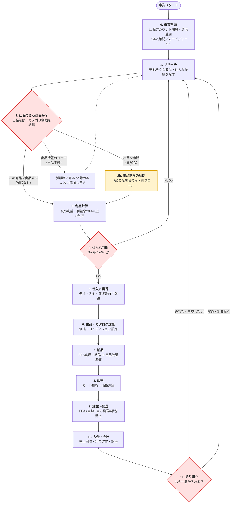

# Amazon物販 業務フロー ── ① 大きな流れ（全体像）

> T-20260529-001 / Phase 1
> 担当: 秘書カズヨ ／ 作成: 2026-05-29
> 対象: **Amazon物販に限定**（FBA・小口プラン・個人事業を主に想定）
> このページは「まず全体像を掴む」ための地図です。各段階の細部（準備・登録先・ToDo）は Phase 2 以降で分解します。

---

## 0. 全体像を一言で

Amazon物販は、ざっくり **「探す → 売れるか確かめる → 仕入れる → 売る → お金にする → 振り返る」** のループです。
このループを **1周回すこと**（＝軸B / T-004 の体験仕入れ）が、まず社長に体感していただきたいゴールです。

そして社長が最も迷っている **「仕入れ」** は、実は **「仕入れる前にやる確認作業」** がカギになります（特に出品制限チェック）。下の図で赤系のゲート◇がそれです。

---

## 1. 大きな流れ（メインのループ）

---

## 2. 各段階のひとことガイド（Phase 2 で何を分解するか）

| # | 段階 | この段階のゴール | Phase 2 で分解する「準備・登録先・ToDo」の例 |
|---|------|----------------|----------------------------------------------|
| 0 | **事業準備** | 売れる状態を作る | 出品アカウント開設（本人確認書類）・小口/大口の選択・決済カード登録・リサーチツール導入・古物商許可（中古を扱う場合） |
| 1 | **リサーチ** | 利益が出そうな候補を見つける | Keepa/セラースプライト等の使い方・需要と競合の見方・仕入れ先サイトの巡回 |
| 2 | **出品可否チェック** ◇ | 仕入れ前に「売れる商品か」を確定 | セラーセントラルでのASIN確認手順・3分岐の判定・トラップ2点（ノーブランド/新品不可）の確認 |
| 2b | **出品制限の解除** | 制限商品を売れる状態に | 3段階解除（0円解除→1点→10点）・領収書条件・申請書類の工夫・落とし穴3つ |
| 3 | **利益計算** | 利益率20%を満たすか判断 | FBA手数料・送料・原価・ポイント込み実質価格・真の利益（FBA/自己発送/MSS） |
| 4 | **仕入れ判断** ◇ | Go/NoGo を決める | 損益分岐・在庫リスク・資金繰り・撤退ライン |
| 5 | **仕入れ実行** | 商品と領収書を手に入れる | 仕入れ先別の発注手順・領収書PDFの取得・仕入れ記録（CSV）・**仕入れ先リスト** ←社長の最重要関心 |
| 6 | **出品・カタログ登録** | Amazonに商品を載せる | 既存カタログ相乗り/新規登録・価格設定・コンディション・画像 |
| 7 | **納品** | 在庫を売れる場所に置く | FBA納品プラン作成・ラベル貼り・倉庫搬入 / 自己発送の在庫管理 |
| 8 | **販売** | 実際に売れる | カートボックス獲得・価格自動改定・在庫切れ防止 |
| 9 | **受注〜配送** | お客様に届ける | FBAは自動・自己発送は梱包/発送/追跡番号 |
| 10 | **入金・会計** | 利益を確定させる | 売上金サイクル・手数料控除・記帳・確定申告の準備 |
| 11 | **振り返り** ◇ | 次の一手を決める | KPI（利益率・回転）・再仕入れ判断・SKU積み上げ |

◇ = 「判断・確認ゲート」。ここを飛ばすと損失につながりやすい要所です。

---

## 3. 社長の関心に対する位置づけ

- **最も迷っている「仕入れ」（段階5）** → Phase 3 で最深掘り。さらに、その前段の **段階2（出品可否チェック）・段階2b（制限解除）** が「仕入れの成否を左右する関門」なので、ここも厚く描きます（社長提供の規制解除マニュアルが一次ソース）。
- **仕入れ先リストのスプレッドシート化** → Phase 4。既存の「仕入れ先カタログ30件」（T-20260521-002）を土台に、**連絡先・取扱商品・条件**の列を足して表計算形式に整えます。

---

## 4. このあとの進め方（社長の確認をいただきたい点）

1. **この全体像でイメージは合っていますか？** 段階の粒度・順番・抜け漏れの感覚をお聞かせください。
2. 問題なければ Phase 2（各段階の ToDo 細分化）へ進みます。**仕入れ周り（段階2・2b・5）から先に細かくする**のが社長の関心に沿うと考えますが、頭（段階0の事業準備）から順に下りる方がよければそちらにも対応します。
</content>
